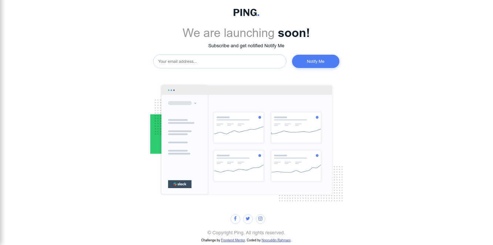

# Frontend Mentor - Ping coming soon page solution

This is a solution to the [Ping coming soon page challenge on Frontend Mentor](https://www.frontendmentor.io/challenges/ping-single-column-coming-soon-page-5cadd051fec04111f7b848da). Frontend Mentor challenges help you improve your coding skills by building realistic projects. 

## Table of contents

- [Overview](#overview)
  - [The challenge](#the-challenge)
  - [Screenshot](#screenshot)
  - [Links](#links)
- [My process](#my-process)
  - [Built with](#built-with)
  - [Useful resources](#useful-resources)
- [Author](#author)
## Overview

### The challenge

Users should be able to:

- View the optimal layout for the site depending on their device's screen size
- See hover states for all interactive elements on the page
- Submit their email address using an `input` field

### Screenshot

- Solution URL: [github](https://your-solution-url.com)
- Live Site URL: [netlify](https://ping-comming-soon.netlify.app/)

## My process

### Built with

- Semantic HTML5 markup
- CSS custom properties

### Useful resources

- [Mozila Developeer Network](https://www.example.com) - 
It really helped me out .
## Author

- Website - [Nooruddin](https://github.com/nooruddin-rahmani)
- Frontend Mentor - [@nooruddin-rahmani](https://www.frontendmentor.io/profile/nooruddin-rahmani)
- Twitter - [@Noorudd79181763](https://twitter.com/Noorudd79181763)
